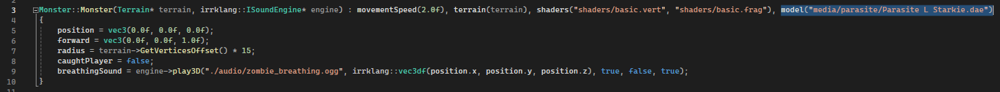

# Forest Game Report
Forest Game is a horror game about collecting pages.

## Dependencies
- Assimp
- GLAD
- GLFW
- GLM
- LearnOpenGL files, including mesh.h, model.h, shader.h, shader_m.h
- stbi_image.h header file
- irrKlang

## Third-party Assets
- Monster model and textures - https://www.mixamo.com/#/?page=1&query=parasite&type=Character
- Grass texture - https://opengameart.org/node/21686
- Dirty Grass texture - https://opengameart.org/content/4k-seamless-grass-dirt-ground-texture-with-all-shader-maps-dirtygrassseamlesscolorjpg
- Tree model and textures - https://sketchfab.com/3d-models/pine-tree-e52769d653cd4e52a4acff3041961e65#download
- Ghostly Presence music (Website: Bensound, Artist: FoePound, License code: ZCM0KIEXOOQO8DYV) - https://www.bensound.com/royalty-free-music/track/ghostly-presence-creepy-dark
- Paper Grab sfx - https://pixabay.com/sound-effects/paper-grab-259214/
- Walking on Leaves sfx - https://pixabay.com/sound-effects/walking-on-leaves-260279/
- Zombie Breathing sfx - https://pixabay.com/sound-effects/zombie-breathing-70682/

## YouTube Video
YouTube Video: [insert some youtube video]

## Game Objective
The objective of Forest Game is to search the environment for five pages while keeping an eye out for the monster.

Walk into a page to collect it.

The monster is always chasing you. To stop it, look at it.

If you collect all five pages, you win the game.

If the monster catches you, you lose.

## Controls
- **WASD Keys** - Move forwards, left, right and backwards
- **Escape** - Quit game

## Design Diagrams

### Class Diagram
The following diagram highlights the main classes, member variables and methods within the game:

## Programming Patterns

### Game Loop

### Update Method

### Composition

## Game Features/Mechanics + Example Code

### Moving Player
The player can move and look around the terrain, restricting the player to stay within the boundaries. The player's y position is based on the terrain's heightmap.

### Moving Monster
The monster will move and rotate towards the player while they are not looking. The monster's y position is also based on the terrain's heightmap.

### Page Collection
Pages will disappear when the player walks into them and collects them.

### Model-View-Projection
Everything in the game is rendered using Model-View-Projection matrices.

### Procedural Terrain Generation
The terrain is generated procedurally with three different biomes, giving a different terrain every time you play the game.

### Texture mixing
Textures in the terrain are mixed together to create "middle" biomes.

### Scene Animations
Some objects in the scene are animated, moving/rotating over time.

### Loaded Models with Textures
Models are loaded with textures using the Model class. Multiple formats are used.

### Keyboard/Mouse Controls
The game is controlled using the keyboard and mouse.

### Audio Playback
The game has background music as well as sound effects for different objects.

## Exception Handling

### System/Subsystem Initialisation

## Evaluation
I believe that I have created a software prototype of a game that demonstrates a good understanding of writing C++ and OpenGL programs.

I am particularly proud of the basic lighting implementation, as it significantly improves the aesthetics of the game by making colours less flat.

If I were to improve something about this project, I would implement some UI to create visual feedback for when the player collects pages.